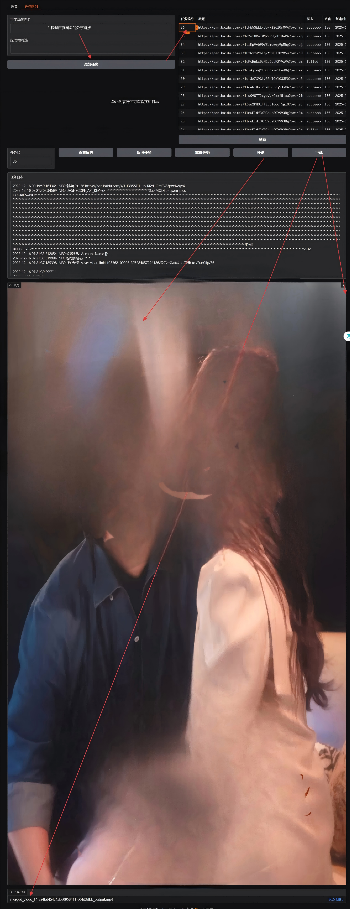
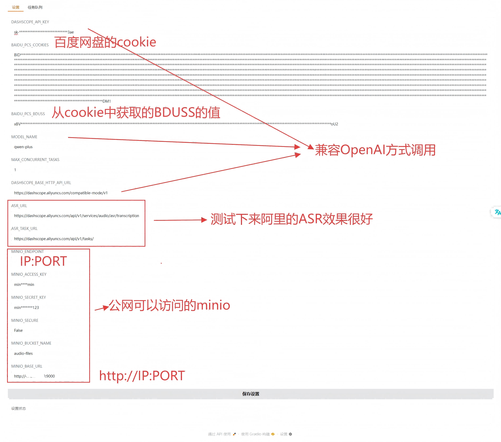

### <p align="center">「[简体中文](./README.md) | English」</p>
# VideoAutoClip

VideoAutoClip is a fully automated short drama promotion video generation tool. It leverages AI technology to streamline the process from raw footage to the final promotional video. The project integrates cloud storage downloading, Automatic Speech Recognition (ASR), Large Language Model (LLM) content analysis, and automated video editing.



## ✨ Key Features

- **Fully Automated Pipeline**: Input a Baidu Netdisk link, and the system automatically handles downloading, merging, recognition, editing, subtitle mounting, and BGM mixing.
- **AI-Powered Analysis**:
  - **ASR**: Uses FunASR (Qwen) to convert audio into subtitles with timestamps.
  - **LLM**: Utilizes LLMs (e.g., Qwen-plus) to analyze the plot, extracting "highlight moments" and "Golden 3 Seconds" hooks.
- **Task Queue Management**: Persistent storage based on SQLite, supporting task queuing, concurrency control, resume capability, and status tracking.
- **Visual Interface**: Gradio-based Web UI for task management, log viewing, video preview, and configuration.
- **Multi-Platform Support**: Docker containerization support for out-of-the-box usage.

## 🚀 Quick Start

### Option 1: Docker Deployment (Recommended)

Ensure you have [Docker](https://www.docker.com/) and [Docker Compose](https://docs.docker.com/compose/) installed.

1. **Clone the repository**
   ```bash
   git clone https://github.com/azoyang/VideoAutoClip.git
   cd VideoAutoClip
   ```

2. **Start the services**
   ```bash
   cd docker
   docker build -t video-autoclip:0.0.1 .
   docker-compose up -d
   ```

3. **Access the UI**
   Open your browser and visit `http://localhost:7862`.

### Option 2: Local Execution

**Prerequisites**:
- Python 3.10+
#### Ubuntu
```shell
apt-get update && \
    apt-get install -y --no-install-recommends \
        build-essential \
        python3-dev \
        ffmpeg \
        imagemagick \
        libsndfile1 \
        libgl1 \
        libglib2.0-0
find /etc -name "policy.xml" -exec sed -i 's/none/read,write/g' {} +        
```
#### windows
- FFmpeg 
    ([Download FFmpeg](https://ffmpeg.org/download.html)), rename it and place it in the root directory at `./ffmpeg/bin/ffmpeg.exe`
- ImageMagick 
    ([Download and install ImageMagick](https://imagemagick.org/script/download.php#windows))
    Then locate your Python installation, and in `site-packages\moviepy\config_defaults.py`, modify `IMAGEMAGICK_BINARY` to the path of the ImageMagick executable.

1. **Install dependencies**
   ```bash
   pip install -r requirements.txt
   ```

2. **Run the application**
   ```bash
   python videoautoclip/task_queue.py
   ```

## ⚙️ Configuration

Configure the following key information in the "Settings" tab of the Web UI:



- **DASHSCOPE_API_KEY**: Alibaba Cloud DashScope API Key (for calling Qwen models).
- **BAIDU_PCS_COOKIES**: Baidu Netdisk Cookie.
- **BAIDU_PCS_BDUSS**: Baidu Netdisk BDUSS.
- **MODEL_NAME**: LLM model name to use (default `qwen-plus`).

## 🛠️ Tech Stack

- **Language**: Python 3.10
- **Web Framework**: Gradio
- **Video Processing**: MoviePy, FFmpeg
- **AI Models**: FunASR, Qwen-plus (via DashScope)
- **Storage**: SQLite, MinIO (Optional)
- **Tools**: BaiduPCS-Py

## 📝 Workflow

1. **Task Creation**: User inputs the Baidu Netdisk link.
2. **Resource Acquisition**: System automatically downloads video assets.
3. **AI Processing**: Extract audio -> ASR to subtitles -> LLM plot analysis.
4. **Smart Editing**: Clips highlight segments based on AI suggestions, adding cover, subtitles, and BGM.
5. **Export**: Generates the final MP4 video for download.

## 🗺️ Roadmap

- [1] Add BGM selection feature
- [2] Support more cloud storage services
- [3] Provide MCP call service
- [4] Add video understanding capability to sample and analyze lifestyle footage, automatically generating subtitles and dubbing

## 📄 License

[MIT License](LICENSE)

Open source is not easy, please star to support. 💕💕💕
